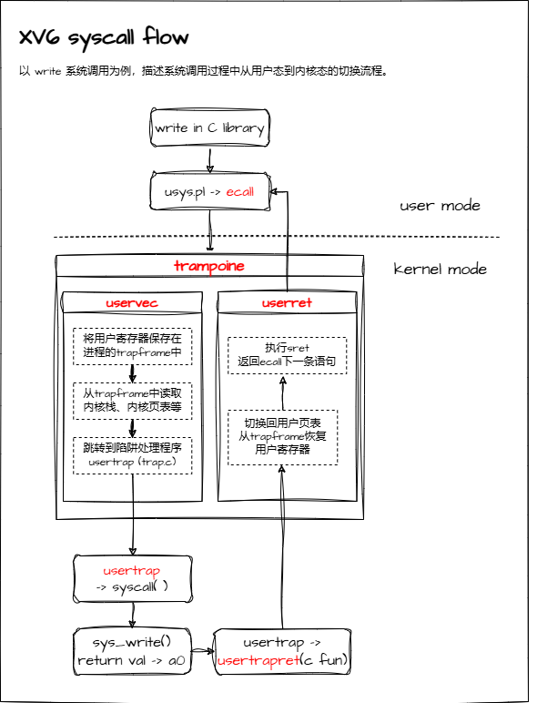
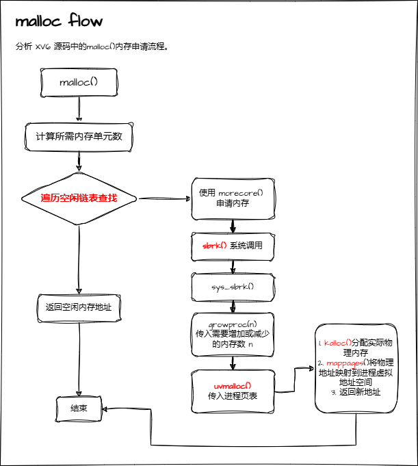

xv6 is a re-implementation of Dennis Ritchie's and Ken Thompson's Unix
Version 6 (v6).  xv6 loosely follows the structure and style of v6,
but is implemented for a modern RISC-V multiprocessor using ANSI C.

xv6本身已经是一个可以运行的简易的操作系统了. 6.S081这门课并不是从零开始空手造一个xv6操作系统, 
而是针对操作系统的不同角度, 在每个lab里让我们根据已有的功能, 对xv6进行优化.

## 1. 为什么要有虚拟内存？

- 隔离
    
    虚拟内存允许每个进程之间都有独立的虚拟地址空间，不同进程间的内存不会互相干扰。实现了**进程间的内存隔离**，防止一个进程的错误导致其他程序的崩溃。
    
- 简化 & 管理
    
    虚拟地址空间允许程序**使用连续的虚拟地址空间**，无需关心实际的物理地址中存在的**内存碎片**问题，简化了内存分配和管理问题。
    
    此外允许操作系统对物理内存**分配进行优化**，将**不活跃的内存数据页转移到硬盘**中，释放物理内存供其他程序使用。
    
- 扩大
    
    虚拟内存可以**将物理内存和磁盘上的存储空间组合**起来使用，使每个进程看起来都有巨大的地址空间提供使用，允许CPU运行内存占用较大的程序。
    
- 文件操作
    
    虚拟内存允许**将文件映射到进程的地址空间中**，可以轻松的读取和写入文件，减少繁琐的文件操作。
    

## 2. 为什么虚拟内存之和能超过物理内存？

操作系统使用 缺页故障，实现了fork写时复制，内存懒分配和磁盘交换策略，为进程提供了许多虚假的虚拟内存。这些虚假的虚拟内存可能并没有实际对应的物理内存，也可能对应的物理内存被交换到了磁盘当中。在进程的视角来看，似乎有远超过物理内存的虚拟内存量。

> 能使用磁盘交换的前提是：具有缺页故障机制。
> 

## 3. XV6 完整的系统调用流程

1. 在用户模式，调用C函数库中的系统调用的封装，如`write`
2. 该封装中会将具体的系统调用号加载到a7中，然后调用`ecall`指令
3. `ecall`指令会做三件事
    1. 切换UMode到SMode
    2. 将用户pc保存到sepc
    3. 跳转到stvec指定的位置，也就是trampoline
4. 在trampoline中（切换用户页表带内核页表中）— `uservec 所做的事情`
    1. 将用户寄存器保存到进程的trapframe中
    2. 从trapframe中读取内核栈、内核页表、中断处理程序`usertrap`的位置，当前CPU核心id
    3. 加载内核栈到sp、切换satp位内核页表，跳转到陷阱处理程序
5. 陷阱处理程序将trapframe中的epc写成`ecall`的下一条指令，调用`syscall`执行系统调用
6. `syscall`调用具体的在内核中的系统调用代码，然后将返回值写到a0
7. `usertrap`执行`usertrapret`，为返回用户空间做准备
    1. 比如设置进程trapframe中的内核相关的信息，内核栈、内核页表、中断处理程序位置等
    2. 设置`sret`指令的控制寄存器，以在`sret`执行时顺利恢复到用户模式
    3. 设置`sepc`为trapframe的epc
    4. 使用函数指针，调用trampoline代码中的userret，并将trapframe作为a0、用户页表位置作为a1
8. trampoline中的userret做的就很简单了，切换回用户页表，从trapframe恢复用户寄存器
9. 执行sret返回到UMode

 

## 4. 操作系统内存管理模块

- 内存的申请与释放
    
    管理系统内存池，实现为为进程分配和释放内存。
    
- 虚拟内存管理
    
    允许进程使用虚拟内存，并将虚拟内存映射到物理内存，包含地址转换，分页机制，页表管理等。
    
- 共享内存
    
    允许多个进程共享相同的内存空间，以便轻松的进程进程通信和数据共享。
    
- 内存监控与性能优化
    
    负责跟踪系统内存使用情况，以及性能分析和优化内存分配策略。
    

## 5. XV6 如何分配内存？

用户态程序通过malloc申请内存，malloc维护一个内存池。当malloc无法提供合适内存时，将使用sbrk系统调用向操作系统申请新的堆内存，sbrk会在页表中做好标记，提供足量的虚拟内存空间，并通过kalloc申请足量的物理内存映射到新的虚拟内存中，以便返回这些虚拟内存供malloc使用。

实际的物理内存中的空闲页面通过链表连接管理，kalloc在该空闲链表中获取物理内存。

```cpp
// Allocate one 4096-byte page of physical memory. 申请的是4096字节的实际物理地址
// Returns a pointer that the kernel can use.
// Returns 0 if the memory cannot be allocated.
void *
kalloc(void)
{
  struct run *r;
  acquire(&kmem.lock);
  // 申请内存操作
  r = kmem.freelist;        // 指向空闲内存块
  if(r)
    kmem.freelist = r->next;
  release(&kmem.lock);
  // 将分配的内存块填充标记
  if(r)
    memset((char*)r, 5, PGSIZE); // fill with junk
  return (void*)r;          // 返回空闲内存指针
}
```

内存链表的初始大小是0，并且它在第一次调用`malloc`且没有可用的空闲块时被初始化。当需要更多内存时，`malloc`会调用`morecore`来扩展内存。

 